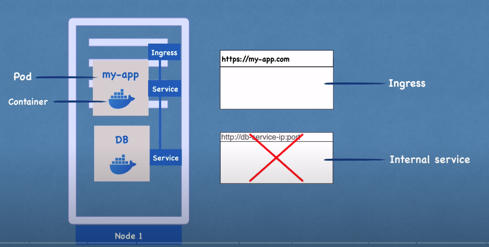
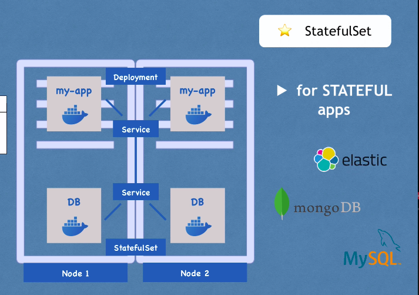

# SERMINAR TÌM HIỂU CÔNG NGHỆ KUBERNETES TRONG QUẢN LÝ CÁC HỆ THỐNG PHÂN TÁN

# Nhóm thực hiện:

+ 20C12007 - Trần Đình Lâm
+ 20C12030 - Huỳnh Lâm Phú Sĩ

____

## Mục tiêu: Tìm hiểu vừa đủ rộng chủ đề Kubernetes, sau đó đào sâu một giải pháp cốt lõi để nhấn mạnh

____

## Giải thích lý do vì sao nên tìm hiểu Kubernetes:

____

## Các bước tìm hiểu, phân tích, thực nghiệm để đạt được mục tiêu đề ra:

### Đặt vấn đề - Hiện trạng

### Lịch sử ra đời của Kubernetes

+ Kubernetes là một công cụ mã nguồn mở (2014) giúp lập trình viên có thể triển khai, mở rộng và quản lý các ứng dụng
  dưới dạng container. Là một công cụ điều phối, theo dõi và xử lý việc lên lịch các container trên một cluster, đảm bảo
  chúng chạy đúng theo kế hoạch.

+ Kubernetes là một hệ sinh thái lớn và phát triển nhanh chóng, teckstack lớn và công cụ hỗ trợ rộng rãi.
  

+ Thời đại triển khai theo cách truyền thống
+ Thời đại triển khai ảo hóa
+ Thời đại triển khai Container
    + Lợi ích:
        + Tạo container và image dễ dàng so với việc dùng VM
        + CI/CD tốt, rollbacks dễ dàng nhanh chóng
        + Phân biệt giữa Dev và Ops
        + Khả năng monitor không chỉ các metrics ở mức Hệ điều hành, mà còn cả mức application health và các tín hiệu
          khác
        + Tính nhất quán về môi trường dev và production
        + Tính khả chuyển giữa các platform cloud, máy thật và các platform với nhau
        + Quản lý tập trung ứng dụng
        + Cô lập các tài nguyên

+ Các lợi ích được Kubernetes cung cấp:
    + Servuce discovery và load balance
    + Điều phối bộ nhớ
    + Tự động rollout và rollback
    + Đóng gói tự động
    + Tự phục hồi
    + Quản lý cấu hình và bảo mật

+ Các concept thành phân của Kubernetes:
    + Cluster:
    + Nodes:
    + Pods:
    + Container:
+ 

    + Control Plane Components: quản lý một cluster cố định. Các component thuộc loại này có thể chạy trên bất kỳ máy
      nào thuộc cluster. Gồm các loại thành phần sau:
        + kube-apiserver:
        + etcd:
        + kube-scheduler:
        + kube-controller-manager:
        + cloud-controller-manager:
    + Node Components:
        + kubelet
        + kube-proxy
        + container runtime
    +

___

#### Dựa theo dàn ý của Bizfly Expert talk Ứng dụng công nghệ container với Kubernetes vào hệ thống IT doanh nghiệp

+ Công nghệ container
    + Lịch sử phát triển các loại hình deployment

+ Các cách triển khai công nghệ container phổ biến

+ Kubernetes (K8s) - công cụ quản lý ứng dụng container tốt nhất hiện nay
    + Giới thiệu kiến trúc Kubernetes tổng quan
    +

+ **Auto scaling** trong K8s trên nền tảng điện toán đám mây: Vì sao cần Auto scaling, các chiều và đối tượng Auto
  scaling, tại sao Kubernetes cần tích hợp với Cloud...

____

## Tài liệu tham khảo:

+ https://kubernetes.io/vi/docs/concepts/overview/what-is-kubernetes/
+ https://www.youtube.com/watch?v=X48VuDVv0do&ab_channel=TechWorldwithNana
+

____
____
____

# KUBERENETES TUTORIAL:

## What is Kubernetes?

+ open-souce **container orchestration tool**
+ Develop by Google
+ Manage containers like docker
+ Manage hundreds-thousands containers in different deployment environments (physical, virtual, cloud)

## Why?

+ From Monolith to Microservies (small-independent services)
+ The controlling of multiple services across multiple envirionments is too complicated (scripts or tools)
+ We need container orchestration tool

## Features:

+ High avalability
+ Scalability
+ Disaster recovery (backup & rollback)

## K8s components:

**Has thousand components, But most of the time we only use some of them**

+ **Node**:
  

+ **Pod**:
    + Smallest unit of k8s
    + Abstraction over container
    + Usually 1 application per **Pod**
    + User only interact with this abstract layer
    + Each Pod gets its own IP address. Each Pod can communicate with each other using that IP
    + Ephemeral: New IP address on re-creation => other Pod have to know that new IP :(
+ **Service**:
    + Permanent IP address
    + Lifecycle of Pod and Service NOT connected
    + Include External service & Internal service
+ **Ingress**:
    + Forwarding to the Service
+ **ConfigMap**:
    + External configuration of application (Pod)
    + **Secret**:
        + Secret, credential data
        + Base64 encoded
+ **Volumes**:
    + A storage component on local or remote machine
    + As a external hard drive plugged into the k8s cluster

+ **Deployment**: (for Stateless apps)
    + Deployment is abstraction layer of Pods
    + Blueprint for Pods
    + User will create Deployments, not just Pods
    + Scale up/down number of replicas of Pods
    + Convenient in interact with Pods
    + Warning: With database Pods, since the replicas and main Pod have to use shared-memory (statefull), we cannot use
      Deployment for this kind Pod, instead of that use **StatefulSet**
      
+ **StatefulSet**:
    + Deploy StatefulSet not easy
    
    