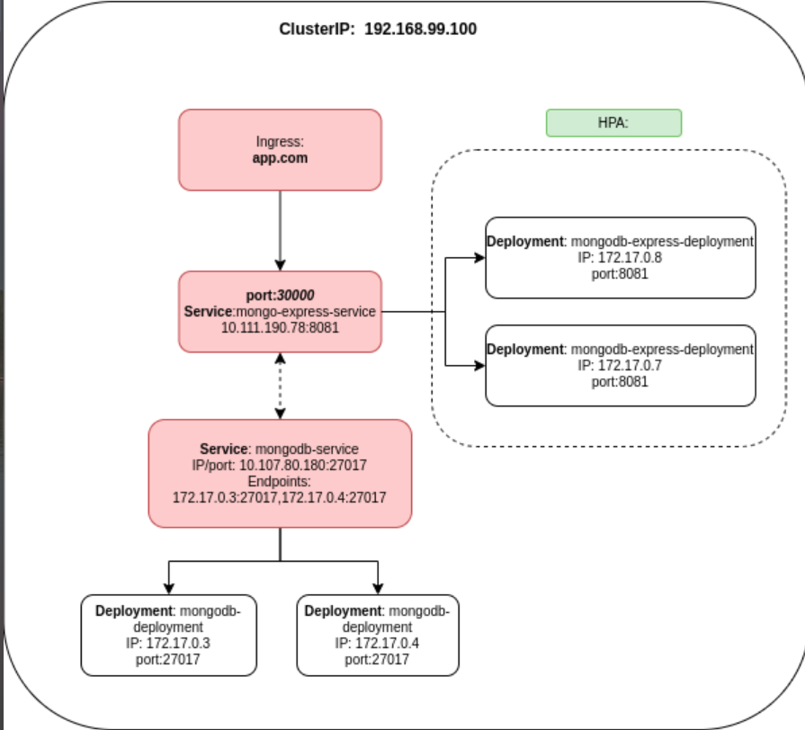
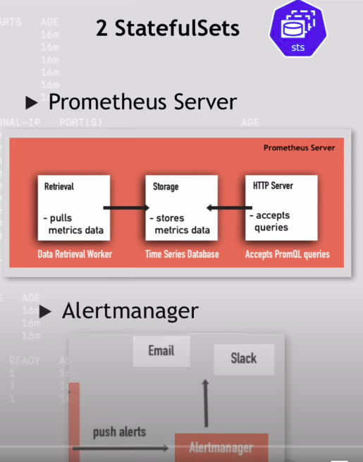
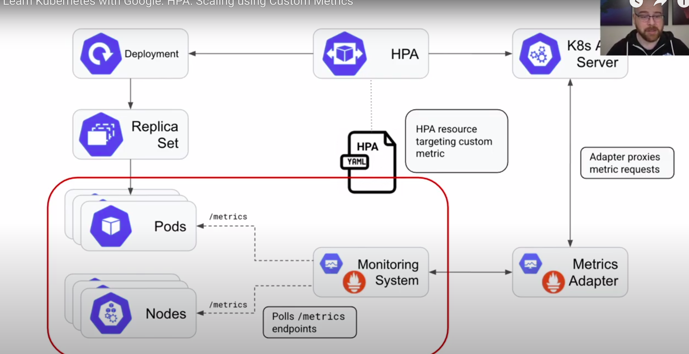
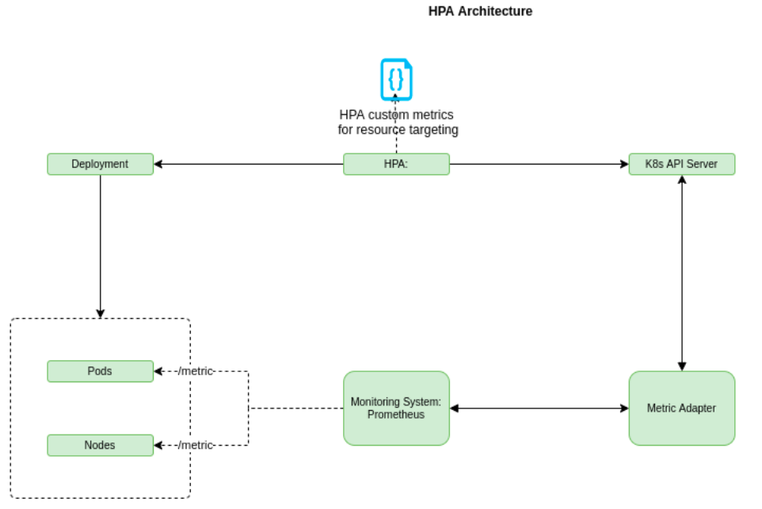

# Horizontal Pod Autoscaler (HPA) with custom metrics

+ ❓HPA là gì?
    + Là chức năng mở rộng (scale out) số lượng các Pods của một service trong cùng một cluster theo hướng tăng/giảm số
      lượng Pod dựa theo việc hệ thống thỏa điều kiện được cài định sẵn
    +

+ ✔️Đã cài đặt và demo được HPA?
    + ✔️Cài đặt một cluster hoàn chỉnh bằng Minikube để giả lập một cluster, tên là "minikube"
    + ✔️Cài đặt giả lập ứng dụng quản lý MongoExpress chạy trên app.com (tự add host)
    + ✔️Bật được Metric server trên cluster này, và chạy một HPA
        + "minikube addons enable metrics-server"
          

___

# Helm

+ ❓Helm là gì?
    + ✔️ Helm là một công cụ open source hữu hiệu để quản lý các gói ứng dụng chạy trên Kubernetes.
    + ✔️ Helm chart giúp người admin có thể định nghĩa, cài đặt, nâng cấp hầu hết các loại ứng dụng của Kubernetes dù là
      ứng dụng phức tạp nhất. Cụ thể:
        + Manage Complexity: Các Chart có thể mô tả được các cấu trúc (structure) của ứng dụng, và quản lý các Chart này
          bằng những lệnh đơn giản
        + Easy Update:
        + Simple Sharing:
        + Rollback:
+ ❓Công dụng và vai trò?
    + ✔️ Việc áp dụng Helm có thể là chìa khóa để áp dụng hàng loạt các microservices, vì việc sử dụng trình quản lý gói
      này giúp đơn giản hóa việc quản lý các microservice rất nhiều.
    + Helm sử dụng một định dạng đóng gói gọi là Chart. Một Chart là một tập hợp các file nhằm mô tả các thành phần tài
      nguyên trong Kubernetes.
    + Một chart có thể rất đơn giản hoặc có thể cực kỳ phức tạp.
+ ✔️ Đã cài được Helm?
    + Hướng dẫn cài Helm: https://helm.sh/
+ ❓Đã dùng Helm để cài các ứng dụng khác?
    + ✔️ Cài prometheus stack?
    + Cài Custom metrics?

___

# Prometheus

+ ❓Prometheus là gì?
    + ✔️ Prometheus là một time series database chuyên dùng để thu thập là lưu trữ các metric của hệ thống và ứng dụng
      nào đó, nhằm mục đích trực quan hóa và tracking sức khỏe, tình trạng của ứng dụng để đưa ra những hành động phù
      hợp và kịp thời
+ ❓Các chức năng chính của Prometheus?
    +
    +
    +
    +
+ ❓Các bước sử dụng Prometheus?
    + ✔️ Bước đầu tiên ta cần thu thập thông tin dữ liệu metric của ứng dụng và lưu vào một time series Database.
      Prometheus là một loại như vậy.
    + ✔️ Bước tiếp theo cần mở rộng Kubernetes Custom Metric API bằng các collector
+ ✔️ Đã cài đặt được Prometheus vào hệ thống?
    + Sử dụng Helm để tải và install Prometheus package
    + "helm install prometheus prometheus-community/kube-prometheus-stack"
    + Sau đó kiểm tra các deployment/service hiện có của gói Chart này:

+ ❓Các thành phần của Prometheus trong Kubernetes:
    + StateFul Set:
        + ✔️ kube-prometheus:
            + Chứa thông tin Prometheus server muốn chạy
            + Đặc tả file cấu hình của địa chỉ các ứng dụng cần lấy metric
            + Đặc tả file cấu hình của các rule cảnh báo của ứng dụng
                + ❓How to add/adjust alert rules?
                + ❓How to adjust Prometheus configuration?
            + Thông tin của helper container
        + kube-alertmanager:
          
    + Deployments:
        + prometheus-grafana:
            + ✔️ forward port của grafana ra ngoài cluster:
                + "kubectl port-forward deployment/prometheus-grafana 3000"
                + admin/prom-operator
        + prometheus-operator
        + prometheus-kube-state-metrics
    + DaemonSet:
        + prometheus-node-exporter: Connect đến một ứng dụng (Service/Pod), chuyển đổi các số liệu của Worker Node sang
          số liệu có thể lưu ở Prometheus
    + ✔️ ServiceMonitor:
        + Là một custom Kubernetes component
        + Mỗi instance gắn với một loại service riêng, để thu thập /metrics
        + Mỗi instance có đánh dấu label "release: prometheus", từ đó cho phép Prometheus đi thăm dò các service này để
          thu thập /metrics
    + alertmanager-operated

___

+ ❓Custom Resource Definitions là gì?

___

+ ❓Metric Adapter là gì?
+ ❓Vai trò của Metric Adapter?

___

+ ❓Kubernetes Operator là gì?
+ ❓Vai trò của Kubernetes Operator?

___

# Kiến trúc hệ thống như thế nào?

+ 👉️Link vẽ diagram:
    + https://drive.google.com/file/d/1193whmt-CrJFrO-BWoPx4FELWleY2PuK/view?usp=sharing

+ ❓Tham khảo mô tả kiến trúc hệ thống 1:
    + 
+ ❓Vẽ lại kiến trúc hệ thống theo nhu cầu của đồ án:
    + 

___

# Quá trình cài đặt và khởi tạo hệ thống HPA with Custom Metrics

+ ✔️ Các bước cài đặt từng thành phần theo thứ tự:
    + Dựng một cluster rỗng
        + minikube start
    + Dựng ra các namespace
        + kubectl apply -f 1-namespaces
    + Cài ứng dụng cần vận hành
        + kubectl apply -f 1-mongo
            + 0-mongo-configmap.yaml
            + 1-mongo-secret.yaml
            + 2-mongo.yaml
            + 3-mongo-express.yaml
    + Cài đặt Prometheus Operator thành các Custom Resource Definition
        + kubectl apply -f 2-prometheus-operator-crd
    + Từ bước này bắt đầu tách namespace ra để quy hoạch cho tốt
        + kubectl apply -f 3-prometheus-operator
    + Cài đặt prometheus
        + kubectl apply -f 4-prometheus
        + kubectl port-forward service/prometheus-operated 9090 -n monitoring
    + Cài đặt ứng dụng demo
        + kubectl apply -f 5-demo
    + Nếu mongo-monitor chưa chạy được custom metric, ta cài custom metric
        + kubectl apply -f 6-prometheus-adapter

+ ❓Các custom metric có thể monitor được để phục vụ HPA?
+ ❓Hệ thống lựa chọn loại custom metric nào? Vì sao?

________
# ❓Cơ chế gửi warning đến admin như thế nào?

Các bước cài đặt từng thành phần theo thứ tự:

________

