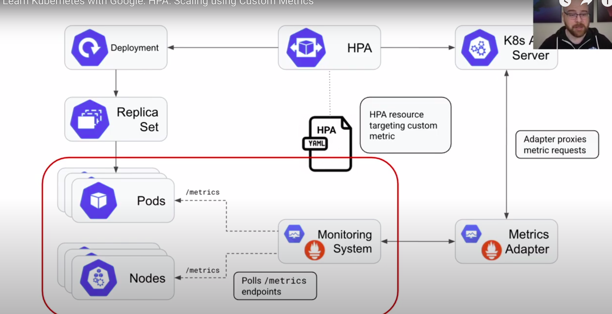

# HPA in Kubernetes with Custom Metrics

https://www.youtube.com/watch?v=MX0YRlo1dYE&ab_channel=GoogleOpenSource

https://towardsdatascience.com/kubernetes-hpa-with-custom-metrics-from-prometheus-9ffc201991e

https://epsagon.com/how-to/monitoring-kubernetes-part-1/

https://sysdig.com/blog/kubernetes-hpa-prometheus/
+ Install helm
+ Install KEDA into namespace "keda"
+ 

# Send notification when trigger HPA happen