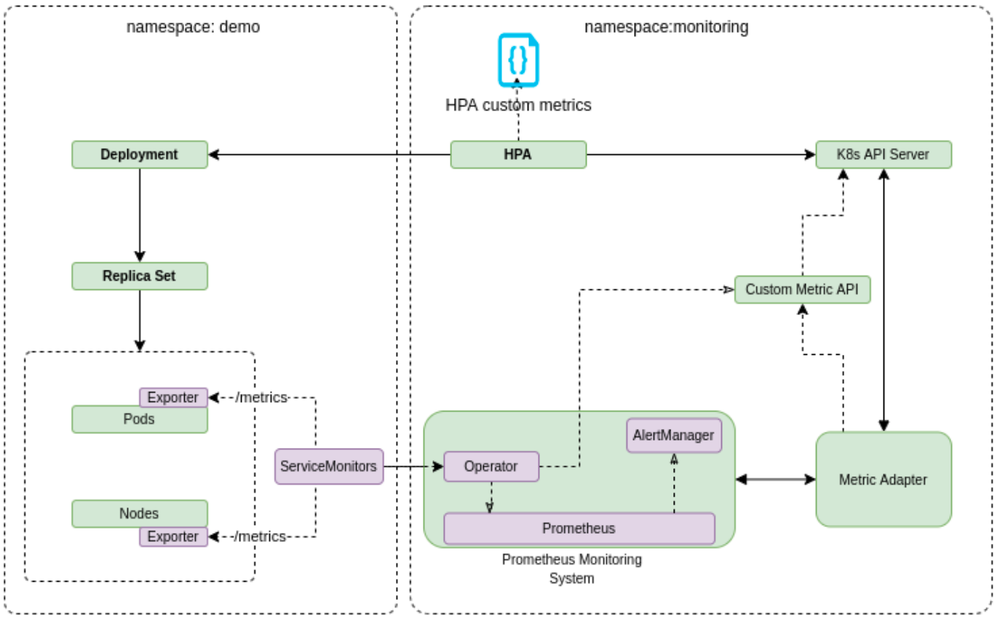

# HPA in Kubernetes with Custom Metrics

## Prometheus Tutorials
+ https://www.youtube.com/watch?v=MX0YRlo1dYE&ab_channel=GoogleOpenSource

+ https://towardsdatascience.com/kubernetes-hpa-with-custom-metrics-from-prometheus-9ffc201991e

+ https://epsagon.com/how-to/monitoring-kubernetes-part-1/
____
## Autoscale with KEDA
+ https://sysdig.com/blog/kubernetes-hpa-prometheus/
+ https://bizflycloud.vn/tin-tuc/scaling-kubernetes-gioi-thieu-ve-event-driven-autoscaling-trong-kubernetes-keda-20211119155957047.htm
+ https://helpex.vn/article/tu-dong-dinh-muc-dich-vu-kubernetes-microservice-cua-ban-voi-keda-609646642b25ab9c2d9277a4

+ Install helm
+ Install KEDA into namespace "keda"

 Tổng quát: KEDA (Kubernetes-based Event-driven Autoscaling) là một thành phần mã nguồn mở được phát triển bởi Microsoft và Red Hat để cho phép bất kỳ Kubernetes workload nào được hưởng lợi từ mô hình kiến trúc event-driven. Đây là một dự án CNCF chính thức và hiện là một phần của CNCF Sandbox. 

KEDA hoạt động bằng cách mở rộng quy mô theo chiều ngang của Kubernetes Deployment hoặc Job. Nó được xây dựng dựa trên Kubernetes Horizontal Pod Autoscaler và cho phép người dùng tận dụng External Metrics trong Kubernetes để xác định các tiêu chí tự động điều chỉnh quy mô dựa trên thông tin từ bất kỳ nguồn event nào, chẳng hạn như độ trễ của Kafka topic, độ dài của Hàng đợi hoặc số liệu thu được từ truy vấn Prometheus.

+ Kiến trúc của KEDA

+ 

+ Scaler: - ScaledObject:
  + Apache Kafka: Dựa trên độ trễ của Kafka topic
  + Redis: Dựa trên độ dài của danh sách Redis
  + Prometheus: dựa trên kết quả của một truy vấn PromQL
  + ...

+ Metrics Adapter:
  + Custom Resource Definition
  + Kubernetes External Metrics API

+ Cách sử dụng KEDA:
  + Tạo Deployment (hoặc Job)
  + Tạo ScaledObject: xác định nguồn của số liệu, cũng như các tiêu chí autoscaling
____

# Send notification when trigger HPA happen