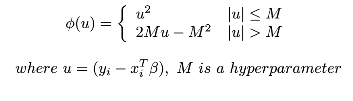

# MÔN HỌC CÁC MÔ HÌNH PHÂN TÍCH DỮ LIỆU

## PHASE 1: TÌM KIẾM TÀI LIỆU THAM KHẢO CHO 2 ĐỀ TÀI

+ Lâm: Các phương pháp Optimization cho Automatic Clustering
+ Sĩ: Các mô hình chống overfitting cho Linear Regression

___

## Chống overfitting

### Kĩ thuật Regularization cho regression

Kĩ thuật thêm vào loss function một đại lượng nữa thông qua một trọng số lamda để điều chỉnh ảnh hưởng của lượng
regularization đối với loss function Một số kĩ thuật thường gặp L1 regularization (LASSO Regression)
Điều chỉnh hàm loss bằng một lượng tổng bình phương các hệ số trong mô hình linear regression

L2 regularization (Ridge Regression)
Điều chỉnh hàm loss bằng một lượng tổng các trị tuyệt đối của hệ số trong mô hình linear regression
___

### Robust regression

Hồi quy mạnh là một dạng kĩ thuật phân tích hồi quy để khắc phục một số hạn chế của phương pháp tham số và phi tham số
truyền thống. Nó được thiết kế để không bị ảnh hưởng bởi các dữ liệu vi phạm giả định. Nó thay thế cho phương pháp hồi
quy theo tổng bình thông thường Các phương pháp thuộc nhóm Robust regression là

+ ### Least Trimmed Squares (LTS)

___

+ ### Least Absolute Value (LAV)

___

### M estimators

#### Andrews' Sine

#### Huber

#### Turkey Biweight

### S estimators

### Quantile Regression

### Document

+ https://machinelearningmastery.com/simple-linear-regression-tutorial-for-machine-learning/
+ https://machinelearningmastery.com/robust-regression-for-machine-learning-in-python/
  
____

+ https://online.stat.psu.edu/stat501/lesson/13/13.3
+ https://machinelearningcoban.com/2017/03/04/overfitting/
+ https://www.kaggle.com/getting-started/222077
+ https://www.kaggle.com/kanncaa1/machine-learning-tutorial-for-beginners/notebook

### Nhóm Kỹ thuật Regularization:

+ L1 Regularization: LASSO Regression:
    + 
+ L2 Regularization: Ridge Regression:
    +
+ Hybrid: Huber Regression:
    + https://cvxr.rbind.io/cvxr_examples/cvxr_huber-regression/
    + 